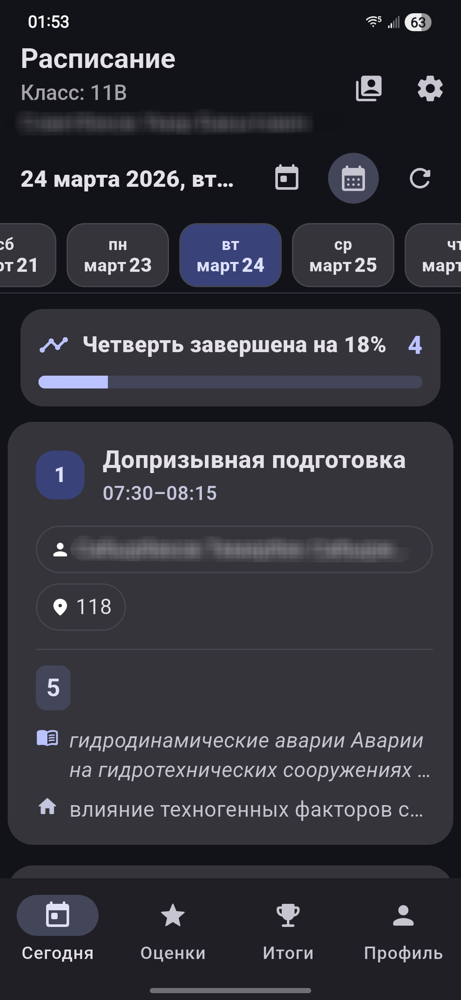
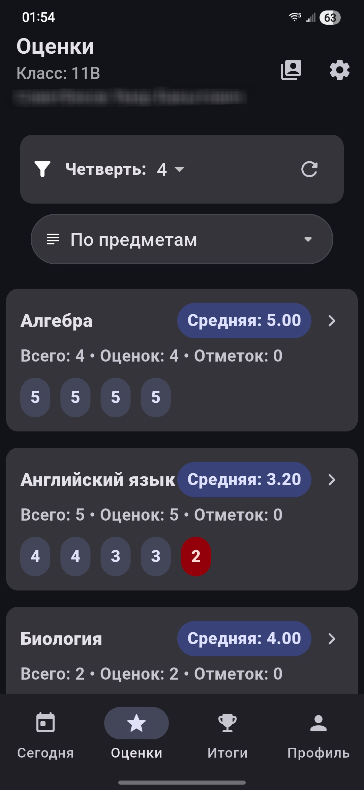
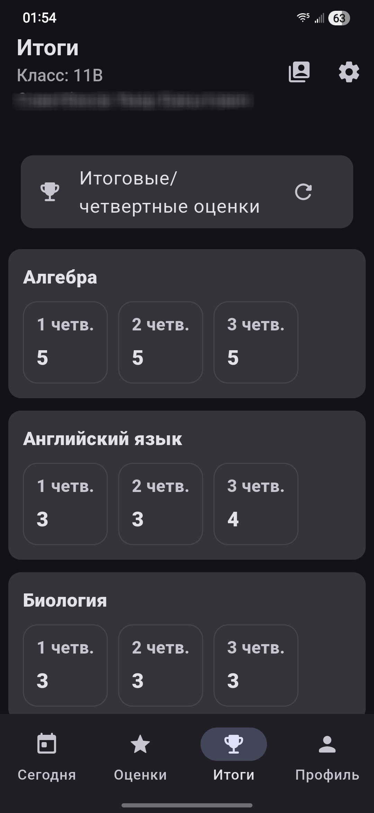
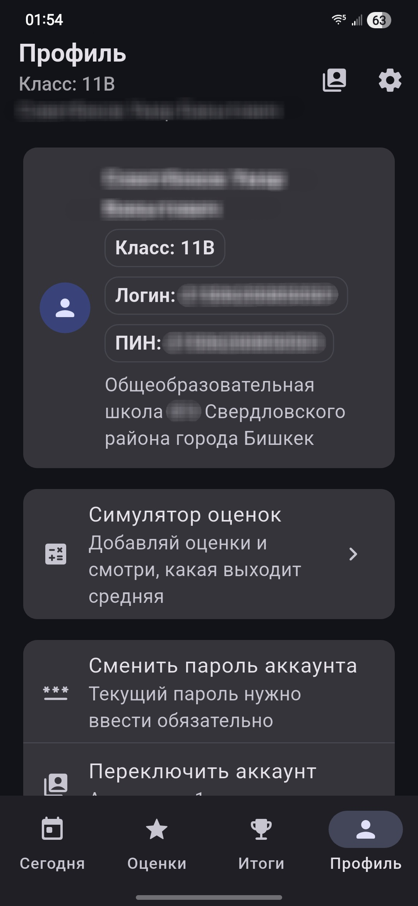
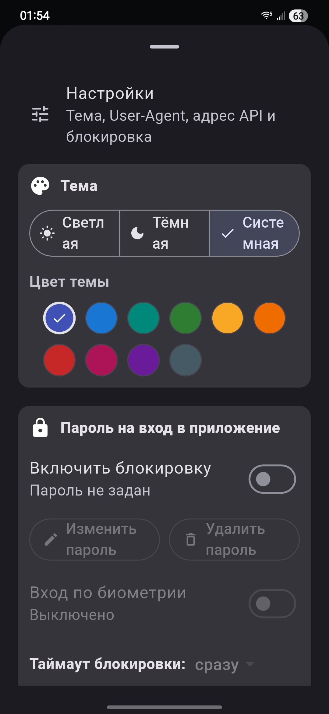
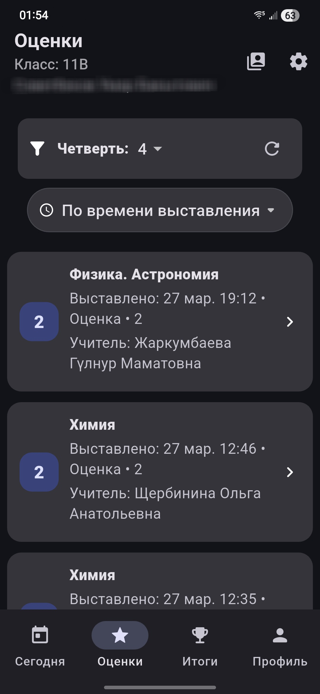
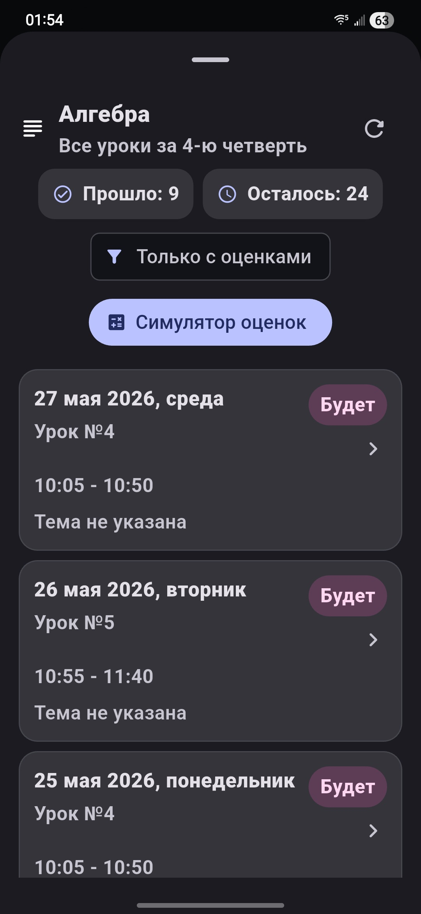

# Kundoluk Plus

Кроссплатформенный клиент для системы «Кундулук», ориентированный на учеников. Основная фишка — **offline-first** архитектура: приложение мгновенно отдает данные из кэша, параллельно обновляя их из сети.

## Основной функционал

* **Работа с аккаунтами:** Авторизация и поддержка нескольких учетных записей на одном устройстве с быстрым переключением.
* **Offline-first кэширование:**
* Мгновенный показ закэшированных данных.
* Фоновое обновление из API.
* Обработка состояний.

* **Учебный процесс:** Расписание с деталями уроков, оценки за четверть (сортировка, группировка, расчет среднего балла), итоговые оценки.
* **Безопасность и кастомизация:** Блокировка приложения (PIN/пароль) с настраиваемым таймаутом, смена пароля аккаунта, управление User-Agent и Base URL.

---

## Интерфейс

---

## Стек технологий

* **UI:** Flutter (Material 3).
* **Network:** `dio` для запросов.
* **Storage:** `hive_flutter` (локальный кэш API), `shared_preferences` (настройки), `flutter_secure_storage` (токены и пароли).
* **Локализация:** `intl`, `flutter_localizations`.

## Структура проекта (`lib/`)

Приложение построено по модульному принципу:

* `app/` — инициализация, Dependency Injection, логика переключения экранов (gate).
* `core/` — общие хелперы, расширения и логика состояний оффлайна.
* `data/` — реализация API-клиентов и локальных хранилищ.
* `domain/` — бизнес-модели и логика (уроки, оценки, периоды).
* `ui/` — экраны, виджеты и логика отображения (BLoC/Provider/etc).

## Развертывание

1. Установите актуальную версию **Flutter SDK**.
2. Склонируйте репозиторий.
3. Выполните `flutter pub get`.
4. Запустите проект: `flutter run`.